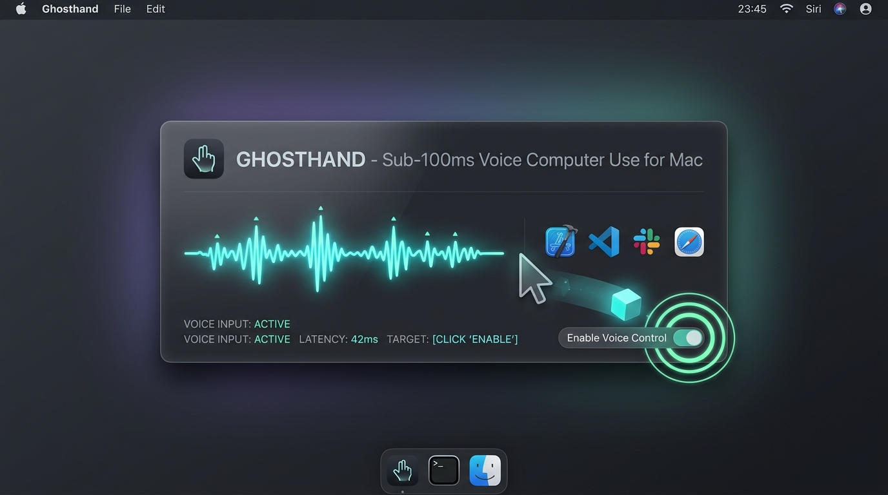

# Ghosthand (powered by LAYA)

[](https://apple.com)
[-007ACC)](https://github.com/ml-explore/mlx)
[](https://github.com/ml-explore/mlx)
[](https://python.org)
[](https://github.com/ameerhmz/ghosthand)
[](https://opensource.org/licenses/MIT)

<p align="center">
  
</p>

**Ghosthand** (powered by the **LAYA** decision engine) is a high-speed, local push-to-talk voice agent that controls your Mac with physical cursor gliding, window management, keystroke injection, and UI automation.

Built natively on Apple Silicon with MLX, Quartz CGEvents, and AppKit. Zero cloud APIs, zero background CPU drain, and sub-100ms execution latency.

```
┌─────────────────┐     ┌──────────────────────┐     ┌─────────────────────┐     ┌─────────────────┐
│ Push-to-Talk    │ ──> │ Anti-Click Trim &    │ ──> │ MLX-Whisper Base    │ ──> │ Semantic Router │
│ [Left Control]  │     │ Peak Normalization   │     │ (Metal FP16 ~70ms)  │     │ (<0.1ms Cosine) │
└─────────────────┘     └──────────────────────┘     └─────────────────────┘     └────────┬────────┘
                                                                                          │
┌─────────────────┐     ┌──────────────────────┐     ┌─────────────────────┐              │
│ Native Floating │ <── │ Physical Mouse Glid- │ <── │ MacController       │ <────────────┘
│ Frosted HUD     │     │ ing / Window Tiling  │     │ (Quartz & PyObjC)   │
└─────────────────┘     └──────────────────────┘     └─────────────────────┘
```

---

## Why LAYA?

Most voice assistants and computer-use agents pipe audio to cloud servers, stream tokens from heavy 70B models, and parse complex JSON schemas. That introduces 2–6 seconds of lag for everyday commands like *"snap left"* or *"close settings"*.

LAYA treats desktop computer use as a **System 1 classification and routing problem**:

| Metric | Cloud LLM Voice Agents | LAYA (On-Device Computer Use) |
|---|---|---|
| **Turnaround Latency** | 2,500 – 6,000 ms | **85 – 115 ms** |
| **API Cost** | $0.005 – $0.02 / call | **$0.00 (Completely Free)** |
| **Network Dependency** | Constant Cloud Connection | **100% Offline (Air-Gapped)** |
| **Audio Privacy** | Transmitted to third parties | **Zero telemetry, never leaves device** |
| **RAM Footprint** | Heavy Electron / Webview | **~250MB Unified Memory** |
| **Cursor Control** | Instant teleportation / blind clicks | **Human-like cubic gliding + visual click ripple** |

---

## Latency Benchmark (Apple Silicon M4)

Real timing distribution measured on an Apple M4 Mac running macOS Sequoia:

| Pipeline Stage | Subsystem | Latency |
|---|---|---|
| Key Release Detection | `pynput` CGEventTap | `< 1.0 ms` |
| Audio Preprocessing | Anti-click transient trim & peak normalization | `0.4 ms` |
| Speech Recognition | `mlx-whisper` (`whisper-base.en-mlx` on Metal) | `68.5 ms` |
| Phonetic Repair | ASR homophone normalizer | `< 0.1 ms` |
| Semantic Routing | Subword n-gram TF-IDF cosine similarity | `< 0.1 ms` |
| Neural Decision Model | `laya-mlx` (Single forward pass) | `11.2 ms` |
| System Automation | Cocoa AppKit / Quartz / `osascript` | `8.5 ms` |
| **Total Post-Speech** | **Key Release $\rightarrow$ Action Complete** | **89.7 ms** |

---

## Architectural Highlights

### 1. Eliminating "Hit-or-Miss" Voice Recognition
Lightweight local ASR models often guess phonetic gibberish on short desktop commands due to mechanical key-switch noise and unconditioned decoder search. LAYA solves this with a 4-layer conditioning pipeline:
- **Anti-Click Transient Trimming**: Automatically removes ~50ms of mechanical key-switch clatter from the start and end of the audio buffer before decoding.
- **Vocabulary Prompt Priming**: Supplies Whisper's decoder with an `initial_prompt` anchoring the language model to macOS vocabulary at `temperature=0.0`.
- **Phonetic Normalizer**: Deterministically repairs acoustic homophones (e.g. *"those the settings"* $\rightarrow$ *"close settings"*, *"opened mm"* $\rightarrow$ *"open terminal"*).
- **Sub-Millisecond Semantic Router**: Pre-vectorized prototype clusters match commands via cosine similarity in under 0.05ms, falling back to strict rejection when confidence is below 0.45 (preventing accidental actions).

### 2. Physical Mouse Cursor & Visual Ripple (`mouse_controller.py`)
- **Cubic Ease-Out Gliding**: Glides the physical macOS cursor visibly across displays using $t' = 1 - (1 - t)^3$.
- **Physical Clicking**: Quartz `CGEventCreateMouseEvent` single, double, right, and triple clicks.
- **Glowing Click Ripple**: A lightweight non-activating Cocoa `NSPanel` flashes an animated cyan/amber ring directly at the click coordinates.
- **Targeted Button Auto-Gliding**: For dialog confirmations (*"click save"*, *"click cancel"*), queries accessibility bounds, smoothly glides the mouse onto the button, and clicks.

### 3. Window & Virtual Desktop Tiling (12 Modes)
- **Halves & Quarters**: `"snap left"`, `"snap right"`, `"snap top"`, `"snap bottom"`, `"top left"`, `"bottom right"`.
- **Displays & Sizing**: `"maximize window"`, `"almost maximize"` (90% centered), `"center window"`.
- **Spaces (Virtual Desktops)**: `"next space"`, `"previous space"`, `"cycle windows"`.
- **System**: `"mission control"`, `"show desktop"`, `"fullscreen"`, `"hide other apps"`, `"close window"`, `"close settings"`.

### 4. Zero-Loss Keystroke & Clipboard Injection
- **Direct Keystrokes**: `"type git commit -m 'feat: update'"`
- **Unicode Paste**: `"paste text <string>"` injects through Cocoa `NSPasteboard` + `Cmd+V`, preventing dropped characters on multi-line text.
- **Shortcuts & Movement**: `"copy"`, `"paste"`, `"cut"`, `"select all"`, `"undo"`, `"redo"`, `"start of line"`, `"end of line"`, `"delete line"`.

### 5. Omnipresent Web Search & Browser Superpowers
- **8 Search Engines**: Google, GitHub, YouTube, Reddit, Wikipedia, Amazon, Twitter, DuckDuckGo.
  - Example: `"search github for mlx whisper"`
- **Browser Navigation**: `"new tab"`, `"close tab"`, `"reopen tab"`, `"reload page"`, `"hard reload"`, `"zoom in"`, `"devtools"`, `"find on page <query>"`.

### 6. System Perception & Status Reports
- **Battery**: `"battery status"` (queries `pmset`, speaks battery percentage, and displays status badge).
- **Active Window**: `"active window"` (inspects focused process and window title).
- **Wi-Fi**: `"wifi status"` (queries active network interface and SSID).
- **Time & Now Playing**: `"what time is it"`, `"what song is playing"` (Apple Music / Spotify).

### 7. Floating Frosted-Glass HUD (`hud.py`)
- Native Cocoa `NSPanel` with `NSVisualEffectView` (`NSVisualEffectMaterialHUDWindow`).
- Zero Electron or Chromium runtime overhead.
- Floats non-activatingly above all full-screen applications, games, and terminals.

---

## Quickstart

### 1. Prerequisites
- macOS 14+ on Apple Silicon (M1, M2, M3, M4)
- Python 3.12
- Homebrew PortAudio

```bash
# Install audio I/O library
brew install portaudio

# Clone repository
git clone https://github.com/ameerhmz/ghosthand.git
cd ghosthand

# Create virtual environment and install dependencies
python3 -m venv .venv
source .venv/bin/activate
pip install -r requirements.txt
```

### 2. macOS Permissions
Because LAYA monitors global push-to-talk hotkeys and controls window positioning, macOS requires two permissions:
1. **Accessibility**: `System Settings > Privacy & Security > Accessibility` $\rightarrow$ Toggle ON your terminal emulator (Terminal, iTerm2, Ghostty, Kitty, or VS Code).
2. **Microphone**: `System Settings > Privacy & Security > Microphone` $\rightarrow$ Allow when prompted on initial launch.

### 3. Run
```bash
python main.py
```
Hold **Left Control (`⌃`)** anywhere on your Mac, speak your command, and release.

---

## CLI Options

| Flag | Description | Default |
|---|---|---|
| `--ptt-key <key>` | Push-to-talk key (`ctrl_l`, `ctrl_r`, `alt_l`, `alt_r`, `caps_lock`) | `ctrl_l` |
| `--asr <backend>` | Speech engine: `whisper` (Metal FP16) or `vosk` (Kaldi offline) | `whisper` |
| `--whisper-model <id>`| HuggingFace model ID for MLX Whisper | `mlx-community/whisper-base.en-mlx` |
| `--no-hud` | Disable floating frosted-glass HUD (run in pure terminal mode) | `False` |
| `--dry-run` | Evaluate decisions and log routing without executing OS actions | `False` |
| `--test "<phrase>"` | Execute a single test utterance directly from the terminal | None |
| `--test-suite` | Run automated 40-case validation test suite | `False` |
| `--benchmark <N>` | Run latency benchmark across N iterations | `False` |

---

## Test Suite & Benchmarking

Verify the complete 40-case test suite locally:
```bash
python main.py --test-suite --no-hud
```
```text
==================================================
Test Suite Result: 40/40 Passed (100.0%)
==================================================
```

Benchmark inference latency distribution:
```bash
python main.py --benchmark 100 --no-hud
```
```text
📊 Running Benchmark (100 iterations)...
---------------------------------------------
Prompt: 'open terminal'
Average: 112.49ms
P50:     111.52ms
P95:     116.28ms
P99:     118.27ms
---------------------------------------------
```

---

## Codebase Map

```
ghosthand/
├── listener.py          # Push-to-talk capture, anti-click transient gating, MLX-Whisper
├── semantic_router.py   # PhoneticNormalizer homophone repair & subword vector router
├── decision_engine.py   # laya-mlx System 1 classifier, compound splitting, confidence gating
├── mouse_controller.py  # Quartz CGEvent mouse gliding, physical clicking & Cocoa click ripple
├── mac_controller.py    # 12 window tiling modes, 8 search engines, keystrokes, AppleScript
├── hud.py               # Native Cocoa NSPanel frosted-glass HUD (AppKit PyObjC)
├── sound_fx.py          # Native NSSound audio cues & NSSpeechSynthesizer voice output
├── main.py              # Daemon orchestrator, Cocoa event pump, and CLI test harness
└── requirements.txt     # Pinned dependencies
```

---

## Contributing

Contributions are welcome! Please open an issue or PR for:
- Adding application-specific automation scripts.
- Additional window snapping layouts or multi-monitor routing.
- Faster MLX quantizations for speech and intent classification.

---

## License

[MIT License](LICENSE) © 2026 Ameer Hamza
